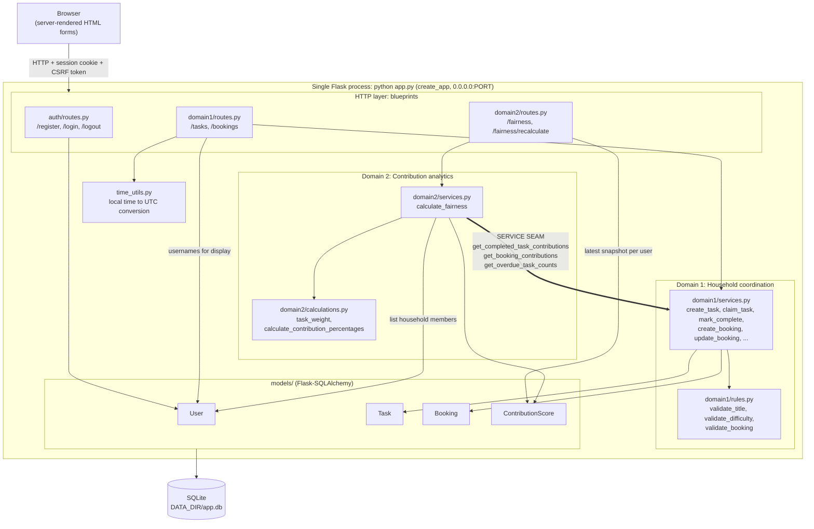
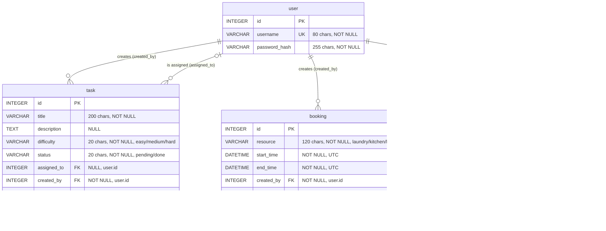

# HouseMate

HouseMate is a small, server-rendered household management application. Housemates can coordinate household tasks, reserve shared resources, and view contribution snapshots.

## Features

- Register and log in with a username and password.
- Create household tasks, claim pending tasks, and mark assigned tasks complete.
- Reserve shared resources and reject overlapping bookings.
- Calculate and retain contribution snapshots for a selected period.

## Architecture

The application runs as one Flask process and persists data in SQLite.

- **Domain 1 — Household coordination** owns task and booking operations, including their validation and authorization rules.
- **Domain 2 — Contribution analytics** calculates and persists contribution snapshots.
- Domain 2 obtains completed-task, booking, and overdue-task data through functions exposed by Domain 1 services. This is the current modular seam between the domains.
- Flask routes translate HTTP requests into service calls; SQLAlchemy models represent the persisted data.
- `User` is shared identity, created through `app/auth`. Domain 2 reads it only to list household members and show usernames.

### Architecture diagram



Domain 2 never queries `Task` or `Booking` directly. It receives plain dictionaries from the three seam functions in `domain1/services.py`. If the domains are split into separate services later, those function calls are where HTTP calls would go.

### Database diagram

The database contains four tables. Domain 1 owns `task` and `booking`, Domain 2 owns `contribution_score`, and `user` is shared identity.



`difficulty` and `status` are enforced by SQLite `CHECK` constraints (`ck_task_difficulty`, `ck_task_status`). The allowed `resource` values are enforced in `domain1/rules.py`, not in the database. The models declare no SQLAlchemy relationship properties; the links above are the foreign-key columns only.

## Task lifecycle

An unassigned task has `status="pending"` and no `assigned_to` user. Claiming it sets `assigned_to` while it remains pending. Completing it changes its status to `"done"` and records `completed_at`.

## Contribution calculation

Completed tasks contribute points according to difficulty: easy = 1, medium = 2, hard = 3. A booking whose start time falls within the calculation period contributes one point to its creator. Each user's contribution percentage is their points divided by the household total, multiplied by 100. If the household has no points in the period, each user's percentage is zero. Overdue assigned tasks are counted separately and do not reduce the contribution percentage. Each calculation adds a new historical snapshot.

## Requirements

- Python 3.11 or newer
- Packages listed in the root `requirements.txt`
- Docker, only if you run the app in a container

## Setup

Clone the repository and enter its directory:

```bash
git clone https://github.com/Thecoolss/HouseMate_SDD_Project.git
cd HouseMate_SDD_Project
```

Create and activate a virtual environment:

```bash
python3 -m venv .venv
source .venv/bin/activate
```

On Debian or Ubuntu, if `python3 -m venv` reports that `ensurepip` is not available, install the venv module first (for example `sudo apt install python3.11-venv`, matching your Python version).

On Windows PowerShell, activate it with:

```powershell
.\.venv\Scripts\Activate.ps1
```

Install the dependencies:

```bash
python -m pip install -r requirements.txt
```

## Configuration

Set environment variables to change application settings without editing source code. These are every setting the application reads. The Docker image sets its own defaults for `PORT` and `DATA_DIR` (the values the provided container template requires).

| Variable | Default (`python app.py`) | Default (Docker image) | Purpose |
| --- | --- | --- | --- |
| `PORT` | `5000` | `8000` | Port the server listens on. |
| `DATA_DIR` | `./data` | `/data` | Directory where the SQLite database `app.db` is stored. The directory is created if needed. |
| `SECRET_KEY` | `dev-secret` | `dev-secret` | Flask session and CSRF signing key. Set a private, strong value outside local development. |
| `HOUSEHOLD_TIMEZONE` | `Europe/Paris` | `Europe/Paris` | Timezone used to interpret and display household date-times. |

**SQLite path:** `$DATA_DIR/app.db`, so `./data/app.db` when run directly and `/data/app.db` in the container. The schema is created automatically on first start (`db.create_all()`), which only creates missing tables and never drops or changes existing data. There is no seed data.

For example, on Linux or macOS:

```bash
export SECRET_KEY="replace-with-a-private-random-value"
export DATA_DIR="./data"
export HOUSEHOLD_TIMEZONE="Europe/Paris"
```

The default secret key is for local development only.

## Run

### Directly on a machine

From the repository root, after the setup steps above, start the application with:

```bash
python app.py
```

The application binds to `0.0.0.0` and defaults to port `5000`. Open <http://localhost:5000/register> to register the first user.

### With Docker

The `Dockerfile` at the repository root is the provided course template with its four `TODO` lines filled in: `python:3.12-slim`, `pip install -r requirements.txt`, an explicit copy of `app.py`, `config.py`, and `app/`, and `python app.py` as the start command. Tests, the virtual environment, `.git`, and local data are not copied into the image.

Build the image and run it with a named volume for the database:

```bash
docker build -t housemate .
docker run -p 8000:8000 -v housemate-data:/data housemate
```

Open <http://localhost:8000/register>. The database lives in the `housemate-data` volume at `/data/app.db`, so it survives the container being removed and recreated.

To use another port or set a real secret key:

```bash
docker run -e PORT=9000 -p 9000:9000 -e SECRET_KEY="replace-with-a-private-random-value" -v housemate-data:/data housemate
```

### Container contract evidence (§7)

Output of the provided checker, `container/run.sh`, run against this repository on 2026-10-10:

```text
=== SDD Assignment 1 contract check ===
Repository: /home/coolss/Uni_Projects/sdd/House_Project
==> Repository shape
  PASS  one Dockerfile, one manifest (requirements.txt)
==> Build from a clean context, no build args
  PASS  image built
  PASS  image size 60 MB
==> Start on PORT=8000 and reach it from the host
  PASS  HTTP 302 from http://localhost:8000/
==> SQLite file under DATA_DIR
  PASS  found in /data: app.db 
==> Data persists, and a second boot does not re-seed
  PASS  volume at /data persists
  PASS  row counts unchanged across restart: booking=0 contribution_score=0 task=0 user=0 
==> PORT override is honoured (not hardcoded)
  PASS  HTTP 302 from http://localhost:9123/
=== ALL CHECKS PASSED ===

```

`HTTP 302` is expected: `/` redirects anonymous users to `/login`.

When running the checker from WSL, set `NAME` explicitly (for example `NAME=sdd-housemate ./run.sh .`), because WSL sets `NAME` to the Windows host name, which is not a valid image tag.

## Tests and coverage

Run the test suite:

```bash
pytest
```

Coverage is reported two ways: for the complete application, and for the core business logic of the two domains, which is what the 70% target applies to.

### Whole-application coverage

```bash
pytest --cov=app --cov-report=term-missing
```

**Measured on 2026-10-09:** 65 tests passed; whole-application coverage was **72%**. This figure also counts Flask routes, app setup, and the timezone helpers in `app/time_utils.py`.

### Core business-logic coverage (Domain 1 and Domain 2)

```bash
pytest \
  --cov=app.domain1.services \
  --cov=app.domain1.rules \
  --cov=app.domain2.services \
  --cov=app.domain2.calculations \
  --cov-report=term-missing
```

**Measured on 2026-10-09:** 65 tests passed, with **93% combined coverage** across these four modules.

Coverage can change as the code and tests change; rerun both commands before submitting and update these results if they differ.

## Project structure

```text
app/
  auth/        Registration, login, and logout routes
  domain1/     Task and booking routes, services, and pure validation rules
  domain2/     Contribution routes, calculation services, and pure calculations
  models/      SQLAlchemy models for the four SQLite tables
  templates/   Server-rendered HTML templates
  static/      CSS
tests/
  unit/        Isolated tests for pure validation, calculation, and timezone functions
  test_*.py    Database-backed service tests and Flask authentication tests
app.py         Entry point: python app.py
config.py      Environment-variable configuration
Dockerfile     Provided container template with its four TODOs filled in
requirements.txt  Pinned dependencies (the one manifest)
ADR.md         Architecture decision record log
AI_USAGE.md    Log of meaningful AI-assisted work
```
